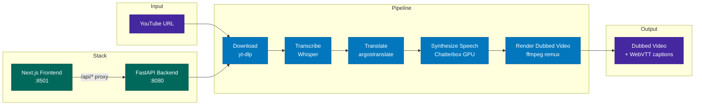

# Foreign Whispers

[](./LICENSE)

YouTube video dubbing pipeline — transcribe, translate, and dub 60 Minutes interviews into a target language.

## Student implementation (NYU Foreign Whispers course)

This branch/fork contains a **full end-to-end solution** for the course pipeline: download → transcribe → (optional) diarize → translate → TTS (with alignment hooks) → stitch, plus the **Next.js Dubbing Studio** and **`foreign_whispers`** library tasks (alignment, re-ranking, evaluation, voice resolution, diarization helpers).

### Constraints we worked under

- **No local NVIDIA GPU** on the primary development machine. Whisper and Chatterbox are **heavy GPU services**; running everything in one `docker compose --profile nvidia` stack was not possible.
- We therefore used a **split architecture**: **GPU lab cluster** nodes run **Speaches** (Whisper, port 8000) and **Chatterbox TTS API** (port 8020); a **CPU-only** host runs **FastAPI** + **frontend** in Docker and calls those services over **HTTP**, with **SSH port forwarding** from the laptop when needed (`scripts/ssh_inference_tunnel.sh`, `docs/REMOTE_GPU_LAB.md`).
- The assignment was completed **solo**. Operating a multi-container pipeline, remote inference, alignment experiments, and all integration notebooks **without** on-machine GPUs made iteration and debugging significantly harder than the “single `docker compose --profile nvidia up`” path in the handout.

### Where we differ from the handout’s expected wiring

| Area | Course / notebook expectation | What we implemented instead |
|------|------------------------------|----------------------------|
| **GPU topology** | All services on one GPU machine via Compose | **Remote** STT/TTS on a lab host; API configured with `FW_WHISPER_BACKEND=remote`, `FW_WHISPER_API_URL`, `CHATTERBOX_API_URL` (see `.env.example` and `docs/REMOTE_GPU_LAB.md`). |
| **TTS API (Notebook 6)** | Optional `speaker_wav` **query parameter** on `POST /api/tts/{id}`; per-speaker voices via `resolve_speaker_wav()` | **`per_speaker_voice`** boolean; `foreign_whispers.voice_resolution.resolve_speaker_wav()` is **implemented and unit-tested**, but the runtime map in `tts_engine` assigns reference WAVs by **round-robin over files** under `pipeline_data/speakers/`, not by calling `resolve_speaker_wav` per `SPEAKER_xx`. Functionally you still get **distinct cloning clips per diarized speaker** when files exist. |
| **Stitch (Notebook 7)** | Dubbed MP4 + **sidecar WebVTT** | We follow **P5** as specified: ffmpeg **remux** (copy video, replace audio); rolling WebVTT is materialized under `dubbed_captions/` and served by `GET /api/captions/{id}`. We **do not** mux subtitles into the MP4 as part of stitch (optional burn-in script exists for local previews only). |
| **Chatterbox upstream** | Default upstream images / deps | On the GPU host we used **lab-specific** `pyproject.toml` overrides (CUDA 12.8 wheels, multilingual fork) and a **tempfile-based WAV** encode path; reference copies live under `contrib/lab-chatterbox-tts-api/` with `contrib/lab-chatterbox-tts-api/README.md`. |

### Lab merge from `remote-foreign-whispers/`

Previously, ad-hoc copies lived under `remote-foreign-whispers/`. That content is now **merged into the main tree**:

- `scripts/remote-cluster/start-chatterbox.sh` and `start-speaches.sh` — generic GPU index (`CUDA_VISIBLE_DEVICES`, no lab-specific UUIDs in git).
- `contrib/lab-chatterbox-tts-api/` — reference **config / speech / pyproject** snippets for the separate Chatterbox repo on the cluster.

### Submitting work upstream (issues + PRs)

See **`docs/UPSTREAM_CONTRIBUTION.md`** for fork setup, **suggested GitHub issue titles/bodies** you can paste into `github.com/aegean-ai/foreign-whispers`, and the exact **`git push` + PR** flow. The GitHub CLI (`gh`) is optional.

### Turn-in artifacts (not in git)

Large **`.mp4` / `.vtt`** for grading live in **`deliverables/`** locally (see `deliverables/README.md`); they are **gitignored**. Submit them via **Google Drive / LMS** as instructed, together with a link to your **pull request**.

## Architecture



## Quick Start

Two profiles are available via Docker Compose:

```bash
# NVIDIA GPU — Whisper + Chatterbox on dedicated GPU containers
docker compose --profile nvidia up -d

# CPU only — no GPU containers (STT/TTS must be provided externally)
docker compose --profile cpu up -d
```

If you use **remote** Speaches/Chatterbox on a lab GPU host, set the `FW_WHISPER_*` and `CHATTERBOX_API_URL` variables from `.env.example` and read **`docs/REMOTE_GPU_LAB.md`**.

Open **http://localhost:8501** in your browser.

## Pipeline Stages

| Stage | What it does | Output |
|-------|-------------|--------|
| **Download** | Fetch video + captions from YouTube via yt-dlp | `videos/`, `youtube_captions/` |
| **Transcribe** | Speech-to-text via Whisper | `transcriptions/whisper/` |
| **Translate** | Source → target language via argostranslate (offline, OpenNMT) | `translations/argos/` |
| **Synthesize Speech** | TTS via Chatterbox (GPU) or Coqui (CPU fallback), time-aligned to original segments | `tts_audio/chatterbox/` |
| **Render Dubbed Video** | Replace audio track via ffmpeg remux (no re-encoding) | `dubbed_videos/` |

Captions are served as WebVTT via the `<track>` element — no subtitle burn-in:

| Endpoint | Source | Output |
|----------|--------|--------|
| `GET /api/captions/{id}/original` | YouTube captions (generated on the fly) | — |
| `GET /api/captions/{id}` | Translated segments + YouTube timing offset | `dubbed_captions/*.vtt` |

## Project Structure

```
foreign-whispers/
├── api/src/                     # FastAPI backend (layered architecture)
│   ├── main.py                  # App factory + lazy model loading
│   ├── core/config.py           # Pydantic settings (FW_ env prefix)
│   ├── routers/                 # Thin route handlers
│   │   ├── download.py          # POST /api/download
│   │   ├── transcribe.py        # POST /api/transcribe/{id}
│   │   ├── translate.py         # POST /api/translate/{id}
│   │   ├── tts.py               # POST /api/tts/{id}
│   │   └── stitch.py            # POST /api/stitch/{id}, GET /api/video/*, /api/captions/*
│   ├── services/                # Business logic (HTTP-agnostic)
│   ├── schemas/                 # Pydantic request/response models
│   └── inference/               # ML model backend abstraction
├── frontend/                    # Next.js + shadcn/ui
│   ├── src/components/          # Pipeline tracker, video player, result panels
│   ├── src/hooks/use-pipeline.ts # State machine for pipeline orchestration
│   └── src/lib/api.ts           # API client
├── download_video.py            # yt-dlp wrapper
├── transcribe.py                # Whisper wrapper
├── translate_en_to_es.py        # argostranslate wrapper
├── tts_es.py                    # Chatterbox client + time-aligned TTS generation
├── translated_output.py         # ffmpeg audio remux + legacy subtitle compositing
├── pipeline_data/               # All intermediate and output files (volume-mounted)
│   └── api/
│       ├── videos/              # Downloaded source MP4s
│       ├── youtube_captions/    # Line-delimited JSON from yt-dlp
│       ├── transcriptions/
│       │   └── whisper/         # Whisper output JSON
│       ├── translations/
│       │   └── argos/           # argostranslate output JSON
│       ├── tts_audio/
│       │   └── chatterbox/       # TTS WAV files per config
│       ├── dubbed_captions/     # Target-language VTT
│       ├── dubbed_videos/       # Final dubbed MP4s per config
│       └── speakers/            # Reference voice clips
├── docker-compose.yml           # Profiles: nvidia, cpu, apple
├── Dockerfile                   # Multi-stage: cpu and gpu targets
├── scripts/
│   ├── ssh_inference_tunnel.sh  # SSH -L forwards for remote STT/TTS
│   └── remote-cluster/          # start-speaches.sh, start-chatterbox.sh (GPU host)
├── contrib/
│   └── lab-chatterbox-tts-api/  # Reference patches for cluster Chatterbox clone
└── docs/
    ├── REMOTE_GPU_LAB.md        # Split-host CPU orchestrator + GPU inference
    ├── UPSTREAM_CONTRIBUTION.md # How to file issues + open PRs to aegean-ai
    └── tts-temporal-alignment-research.md
```

## API Endpoints

| Method | Endpoint | Description |
|--------|----------|-------------|
| POST | `/api/download` | Download YouTube video + captions |
| POST | `/api/transcribe/{id}` | Whisper speech-to-text |
| POST | `/api/translate/{id}` | Source → target language translation |
| POST | `/api/tts/{id}` | Time-aligned TTS synthesis |
| POST | `/api/stitch/{id}` | Audio remux (ffmpeg -c:v copy) |
| GET | `/api/video/{id}` | Stream dubbed video (range requests) |
| GET | `/api/video/{id}/original` | Stream original video (range requests) |
| GET | `/api/captions/{id}` | Translated WebVTT captions |
| GET | `/api/captions/{id}/original` | Original English WebVTT captions |
| GET | `/api/audio/{id}` | TTS audio (WAV) |
| GET | `/healthz` | Health check |

## Development

### Container architecture

```
Host machine
├── foreign_whispers/      ← bind-mounted into API container
├── api/                   ← bind-mounted into API container
├── pipeline_data/api/     ← bind-mounted into API container
│
└── Docker Compose
    ├── foreign-whispers-stt   (GPU)  :8000  — Whisper inference
    ├── foreign-whispers-tts   (GPU)  :8020  — Chatterbox inference
    ├── foreign-whispers-api   (CPU)  :8080  — FastAPI orchestrator
    └── foreign-whispers-frontend      :8501  — Next.js UI
```

The API container is CPU-only — it delegates all GPU work to the STT and TTS
containers via HTTP. The `foreign_whispers/` library and `api/` source are
**bind-mounted** from the host, so edits on the host are immediately visible
inside the container.

### Editing and debugging the library

1. **Start all services:**

   ```bash
   docker compose --profile nvidia up -d
   ```

2. **Edit any file** in `foreign_whispers/` or `api/` on the host (e.g. in VS Code).

3. **Restart the API container** to pick up changes:

   ```bash
   docker compose --profile nvidia restart api
   ```

   To avoid manual restarts, add `--reload` to the uvicorn command in
   `docker-compose.yml`:

   ```yaml
   command: ["uv", "run", "uvicorn", "api.src.main:app", "--host", "0.0.0.0", "--port", "8080", "--reload"]
   ```

   With `--reload`, uvicorn watches for file changes and restarts automatically.

4. **Test via the SDK** from a notebook or Python REPL on the host:

   ```python
   from foreign_whispers import FWClient
   fw = FWClient()             # connects to http://localhost:8080
   fw.transcribe("GYQ5yGV_-Oc")
   ```

5. **Test the library directly** (no Docker needed for pure-Python alignment work):

   ```python
   from foreign_whispers import global_align, compute_segment_metrics, clip_evaluation_report
   ```

   This is the two-phase workflow:
   - **Phase 1 (SDK):** Call `FWClient` methods to drive the pipeline through Docker (download, transcribe, translate, TTS, stitch). Data lands in `pipeline_data/api/`.
   - **Phase 2 (library):** Import `foreign_whispers` directly to iterate on alignment algorithms using data produced in Phase 1. No GPU or Docker needed.

### Local setup (no Docker)

```bash
uv sync                    # install all dependencies
uv run python -c "from foreign_whispers import FWClient; print('ok')"
```

For Jupyter/VS Code notebooks, register the kernel once:

```bash
uv pip install ipykernel
uv run python -m ipykernel install --user --name foreign-whispers
```

Then select the **foreign-whispers** kernel in VS Code's kernel picker.

### When to rebuild

| Change | Action needed |
|--------|--------------|
| Edit `foreign_whispers/*.py` or `api/**/*.py` | Restart API container (or use `--reload`) |
| Edit `pyproject.toml` / add dependencies | `docker compose --profile nvidia build api && docker compose --profile nvidia up -d api` |
| Edit `frontend/` | Frontend has its own hot-reload; no action needed |
| Edit `docker-compose.yml` | `docker compose --profile nvidia up -d` (re-creates changed services) |

### File ownership

The API container runs as your host UID/GID (set in `.env`), so all files it
creates in `pipeline_data/` are owned by you — not root. If you see permission
errors on existing files, they were created by an older root-mode container:

```bash
sudo chown -R $(id -u):$(id -g) pipeline_data/
```

### Frontend

```bash
cd frontend && pnpm install && pnpm dev
```

### Requirements

- Python 3.11
- ffmpeg (system-wide)
- deno (for yt-dlp YouTube extraction)
- NVIDIA GPU recommended for Whisper + Chatterbox inference
